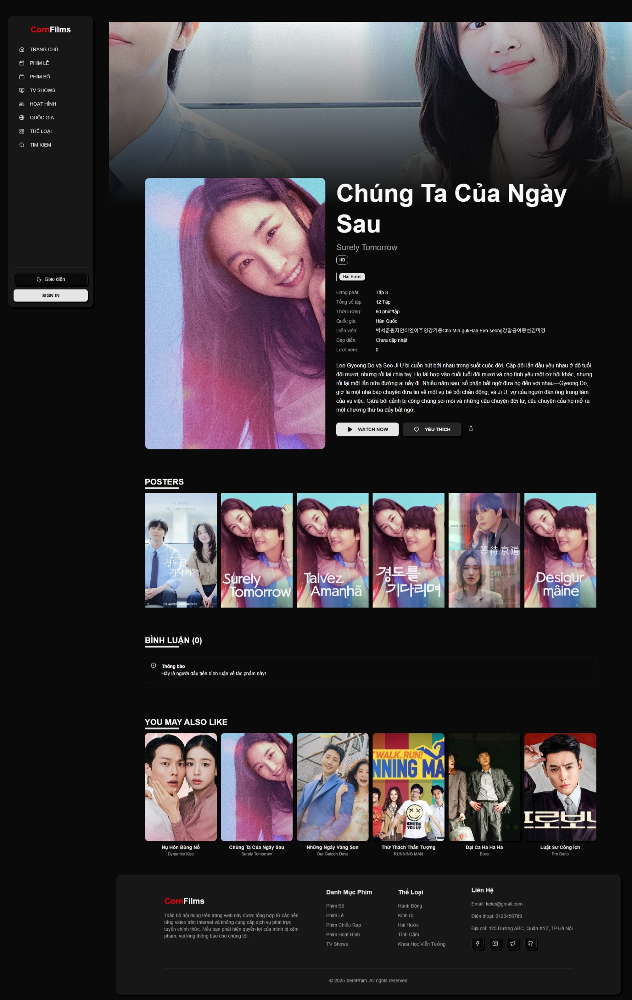
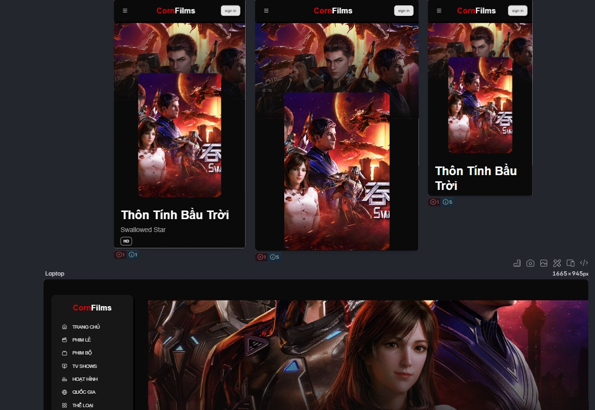

# Popcorn Films

Hot TV Show / Movie Watching Website

# Live Demo
Official website: https://popcornflims.netlify.app/

Movie Sources
- The Movie Database API for render Images for backdrop and posters
- Ophim API for movie and TV show data

# Main technology used
- ReactJS, TailwindCSS, Shadcn-UI
- MongoDb, ExpressJS, NodeJS
- Redux-Toolkit, Cloudiary
- React-Query, Axios
- Swiper
- Lucide-Icons, React-Router-Dom

# Features

- User Authentication (Register, Login, Logout)
- Browse Movies and TV Shows by Categories (Popular, Top Rated, Upcoming, Now Playing, Trending)
- Well-designed homepage/detail/watching pages.
- Search by name, with suggestion keywords, filter result by type.
  Authentication by email/password.
  Bookmark favourite films, store recently watched films. Allowing to edit favorite films .
  Profile page: allowing to change profile photo, name, password.
  Comment: Allowing to give the comments, see who reacts to a comment, delete, and load more comment.

# Screenshots, Preview
## Screenshots / Preview
*Trang chủ với slider phim nổi bật và các danh mục hot*

*Trang tìm kiếm với gợi ý từ khóa thông minh

*Trang chi tiết phim – thông tin, recommendations*

Trang xem phim với player mượt mà và danh sách tập phim
  

*Trang tìm kiếm phim theo quốc gia,..*
 

*Dễ dang tìm lại phim yêu thích*

*Phần bình luận, xóa bình luận*

*Quản lý thông tin cá nhân, đổi mật khẩu, ảnh đại diện*
  

Đăng nhập / Đăng ký

  

*Chế độ tối (Dark Mode) đẹp mắt và bảo vệ mắt*

*Giao diện responsive hoàn hảo trên điện thoại*
